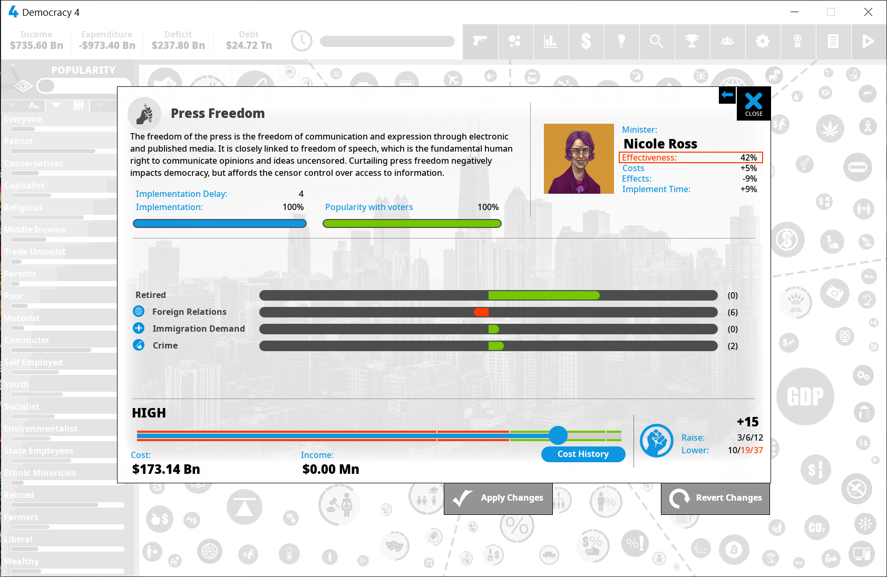

# ayn (democracy-4-randomizer)

Politics shouldn't make sense.



Randomizes policies, simulation variables, and situations. Political capital costs are not affected.

## Installation

Back up your Democracy 4 installation if you want to be absolutely sure you can easily revert. (On Steam, there is no reason to do this because Steam can automatically reinstall the game.)

Install Python 3.8+. Open a terminal in `democracy-4-randomizer/`, then type `python main.py reset`.

A directory named `original/` will appear, containing the base policy files from Democracy 4. The output is something like this:

```
finding Democracy 4
... found! (C:\Program Files (x86)\Steam\steamapps\common\Democracy 4\data\simulation)
finding simulator data
cloning Democracy 4 simulator data to original/
(if you have already run the randomizer, your seeds will behave differently from everyone else's)
... cloned!
finding seed
... saw -1!
running self test.
... passed!
... not randomizing (seed == -1; "reset")
writing to disk
... written! (output)
... written! (C:\Program Files (x86)\Steam\steamapps\common\Democracy 4\data\simulation)
```

Another directory called `output/` will appear. 

On future invocations, this will contain randomized simulator files.

## Invocation

There are three ways to invoke `democracy-4-randomizer`:

`$ python main.py`

Generate a random seed, then randomize Democracy 4.

`$ python main.py 12345`

Using random seed 12345, randomize Democracy 4.

`$ python main.py reset`

Restore Democracy 4 policy files to the backup from `original`.

## Algorithm details

The randomizer takes every policy effect, every cost profile, every income profile and so on, and puts each into a giant deck.

There's even decks for "the number of input connections" and "the number of output connections."

It then shuffles out all those items randomly among the existing policies, such that each item is reused once.